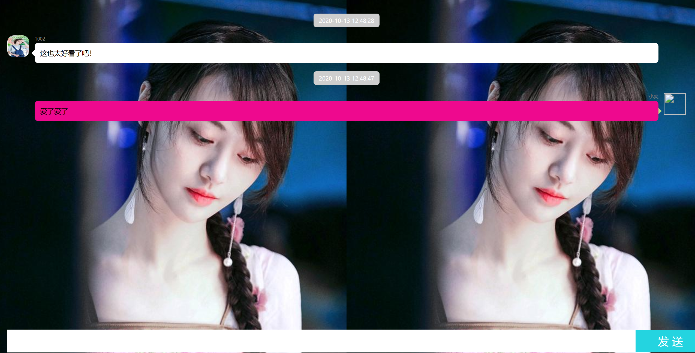

## 项目技术：

HTML5

JavaScript

css

融云IM sdk

## 项目简介：

将自己从小到大的照片放进成长记录中，点击上一张下一张可以切换照片。

将聊天室嵌入，作为每张图片的备注，简单快捷。

## 项目使用：

1.git clone xxx。

2.将xiezhen.html放在浏览器中打开即可预览。

3.目前更换相册的操作是直接在数组里换图片路径。

4.点击成长记录即可进入成长记录集。

## 预览：

