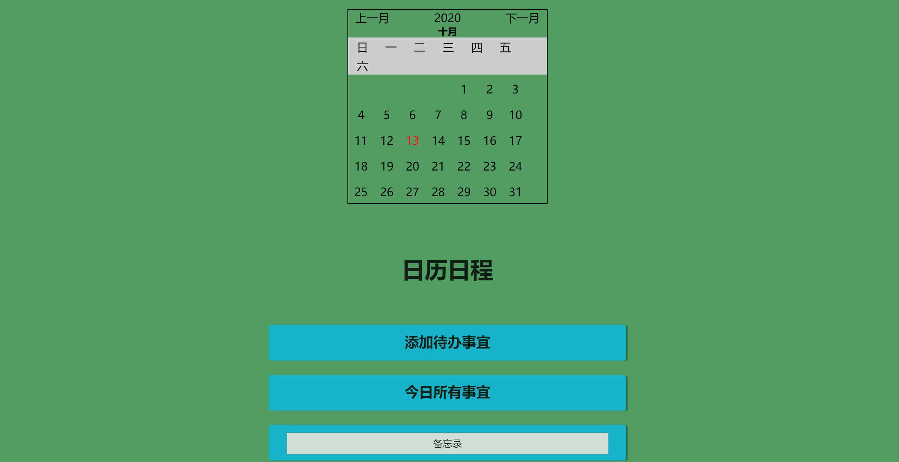
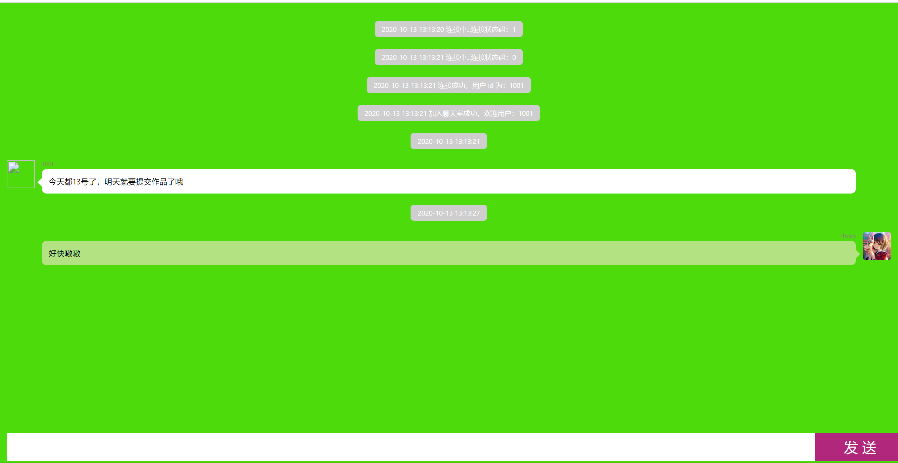

## 项目技术：

HTML5

CSS

JavaScript

融云IM sdk

## 项目背景：

经抽样调研，在全国大学生人群中，约有67.98%的人习惯于将自己的日程发到自己的微信或者文件传输助手，还有很多qq用户会将自己的日程或者重要信息发到自己的小号或者自己的qq。

鉴于超1/3的人日常使用日程，本队将日程作为项目主体，兼备聊天功能，由融云IM sdk实现，将开拓市场，作为为数不多的日程应用。

# 使用Ta：

1.git clone xxx

2.在浏览器中打开rili.html

3.添加日程信息，查看日历，进行聊天等

## see 一 see

