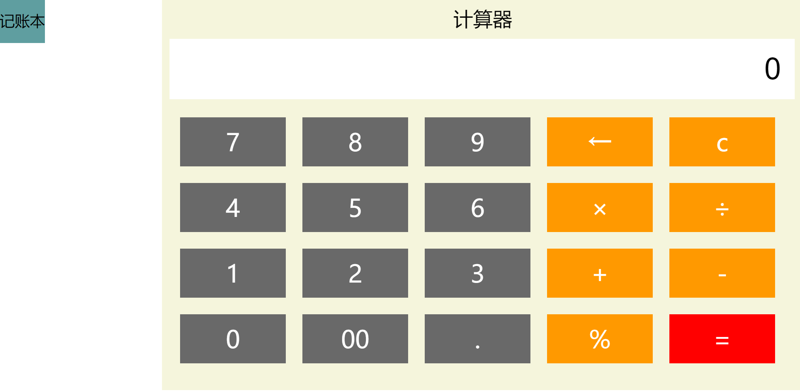

## 项目技术：

HTML5

JavaScript

css

融云IM sdk

## 项目简介：

使用前端相关技术与融云即时聊天sdk，做出一个功能强大的计算器账本。

克服了普通计算器输入后忘记之前输入的信息的弊端，又能比普通账本多计算功能。

可遇而不可求的小助手！

## 项目前景：

目前只是简单的算账计算器，日后会集成更加强大的计算器，囊括各种你想要的计算功能。

## 项目预览：

## 使用方法：

git clone 到本地目录，打开项目中的index.html就能看到计算器，点击左上角记账，可以进入调用融云sdk的记账本。