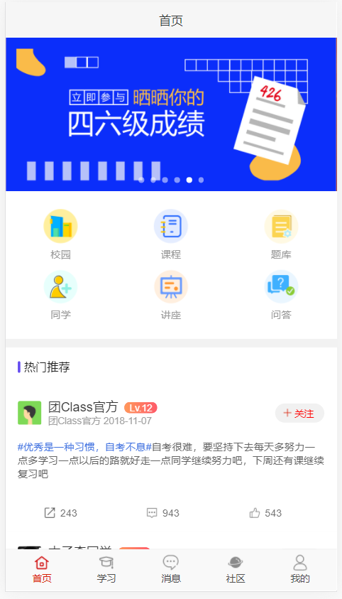
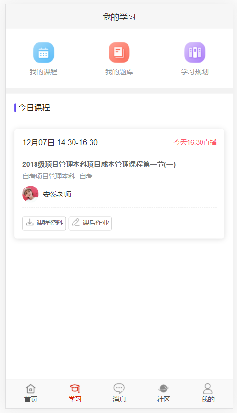
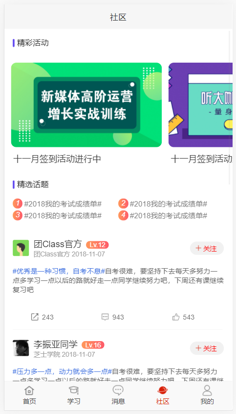
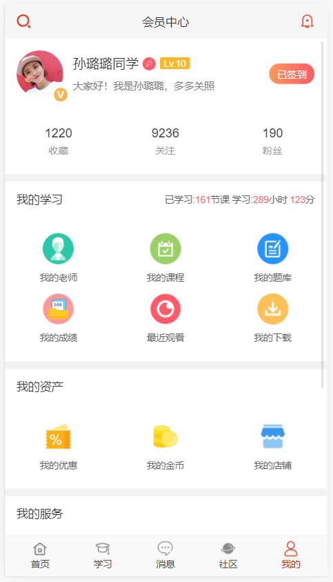

# 我的团队和作品名

- 彩虹-《TuanClass》

# 项目背景&项目简介
-  *项目背景*： 2020年一场疫情席卷全世界，人们的传统办公教学观念发生了巨大的变化，众多的企业学校等等将办公从线下转换成了线上，以往的教学辅助app在如今体现出了巨大的生命活力，本项目在这一背景下，通过集成融云IM实现了一款名为TuanClass的小程序，重点在给出立意和方向。
- *项目简介*：TuanClass力图将班级中的教师学生以及业务等等“团”在一起，使得办公更加便捷，具体内容包括：

   1.首页：首页主要包含各个功能的链接，以及像说说一样各个用户的热门说说
   
   

   2.学习：学习界面主要包含了该用户当前的学习内容，比如今日的课程，我的题库、规划以及可以查看总的课程等等
   
   

   3.消息：消息界面主要包含了各个班级的群聊内容，点击后可以进入群聊
   
   

   4.社区：社区包含了各个用户的留言说说
   
   
   
   5.我的：我的界面展示了各种个人信息，包括关注数和被关注数
   
   

# 安装说明
- 本项目为Springboot项目，为IDEA编译器开发，需要在IDEA中点击file-open导入
- 项目为maven项目，需要本机先安装maven环境
- 导入项目后进入根目录会出现一个pom.xml文件，右键该文件，选择maven-reimport，若干等待后导入项目
- 点击右上角选择application后启动，若启动成功后，在浏览器输入：http://localhost:8082/Tuan/main?userId=XXXX, 其中XXX代表你指定的用户ID
- 回车后会显示启动界面，建议将浏览器开启手机模式进行浏览
>注：本项目为demo，其中部分功能尚未实现

# 融云IM集成说明
- 项目指定融云IM即时通讯SDK，集成了聊天室功能，实现了消息内容

