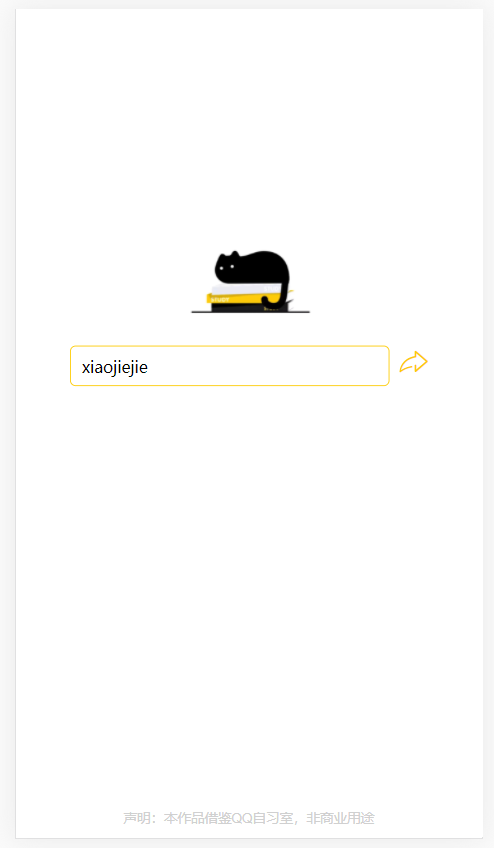
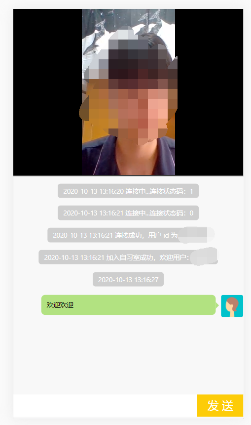

## 我的队伍

- 腾飞三木

## 我的作品

- istudy-live

---

## 作品简述

> 作品借鉴于QQ自习室，非商业用途

- 本作品集成了**融云即时通讯SDK**和**融云音视频直播SDK**

- 本作品提供了一个线上自习室，用户可以通过进入直播间来查看当前正在自习的主播，并且可以加入聊天室与他人交流，改变自习的模式，更好的提高学习效率，解答难题，在疫情时代创造价值。

- 操作步骤：

   1.浏览器输入http://localhost:8081/Rongyun/login，并按F12选择手机模式进入登录界面：
   
   

   2.点击开始后，输入自己想好的id
   
   

   3.进入后，选择创建自习室，待网页弹出确认窗口后即可
   
   
    
    
    
   

   4.选择进入自习室，选择刚刚创建的自习室进入
   
   

   5.进入自习室成功
   
   

---

## 安装过程

- 本项目为Springboot开发，需要提前准备Maven环境，建议使用IDEA开发
- 导入pom中的jar包完毕后，点击启动即可
