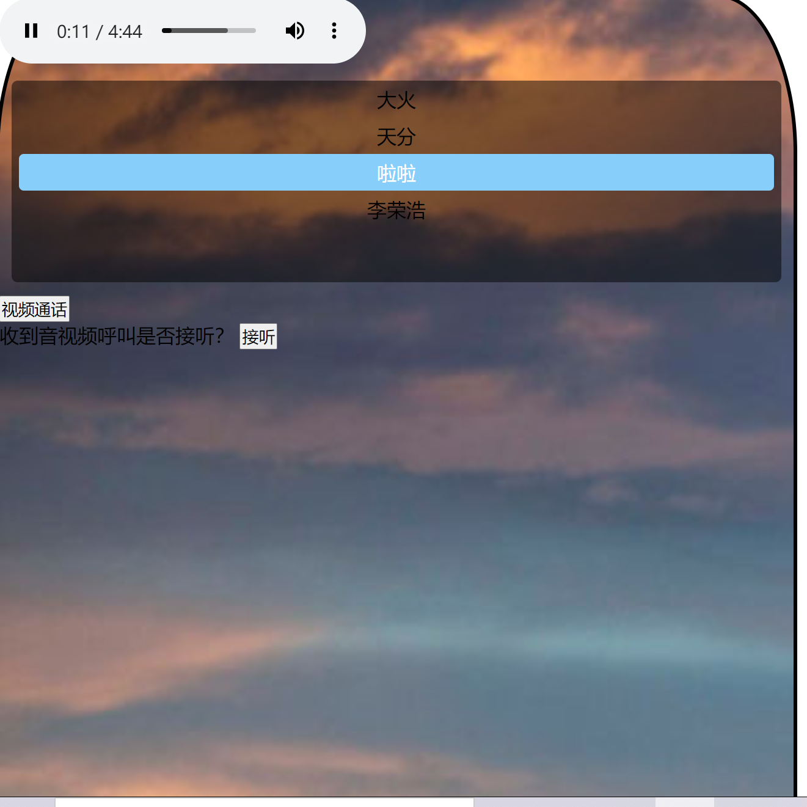

## 项目简介：

本作品集成了融云音视频sdk，与音乐播放器相结合，制作了可边视频边听歌的application。

你可能觉得它毫无用处，当然，现在只是它的雏形，我们团队目前只是把它集成可视化了。

不知道你有没有这样的困惑，每次和你男（女）朋友视频聊天，很无聊又不能挂断的时候，恰好你清唱还不是那么的好听，但是有了本作品，你可以在和他（她）视频的时候跟着唱歌了呀！既不用担心跑调，也不再无聊！

音乐往往能走进人的内心深处~~

开启音乐之旅，你们的感情没准更进一步了呢！

我们团队将继续研发该作品，直到可商业化，我认为这有着巨大的商机，而且没有竞争对手。

现在你只能看到一个相对low的版本，我们团队拼的是概念，是idea，最佳创意奖必是我们的！就是这么自信！懂的自然懂。

如果你想看看雏形，就git clone到本地，然后打开yinyue.html，在网址后加上?1001，再开一个浏览器，复制刚才的网址后把?1001改成?1002,点击音乐的那个list就可以播放，点击视频就可以视频！（目前只是雏形，只能在本地使用哦！）(其实是我们懒得做一个登陆页面啦，就辛苦小哥哥小姐姐用这种方式打开啦)

打开缓慢，请耐心等待！好的项目需要的是时间的沉淀！

由于开启视频就看到我啦，我就不演示开启后的样子啦！