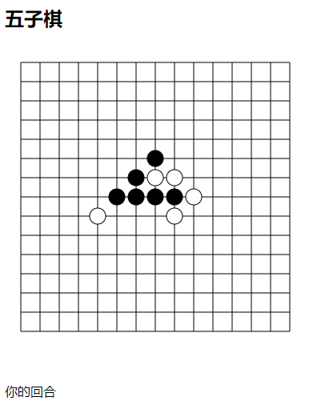

# rong-5
基于融云IMsdk开发的双人在线五子棋小游戏

## 使用的开源库
* rongcloud-sdk
* RongIMLib
* express
* jquery

## 功能
* 在线匹配
* 双人游戏
* 五子棋
* 匿名

## 在线demo
[打开](https://rong-5.herokuapp.com/)

## 项目运行
1. 安装运行环境`npm insatll`
2. 运行`npm start`
3. 浏览器打开[http://localhost:8080/](http://localhost:8080/)
