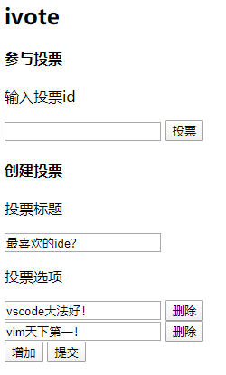

# ivote
使用融云IMsdk开发的面对面投票工具

## 使用的开源库
* rongcloud-sdk
* RongIMLib
* express
* jquery

## 功能
* 在线投票
* 实时查看结果
* 匿名

## 使用方法
1. 创建投票
2. 创建后网页将显示投票结果，不要关闭
3. 告诉参与者投票id
4. 参与者输入投票id参与投票
5. 创建者实时查看投票结果

## 在线demo
[打开](https://rong-ivote.herokuapp.com/)

## 项目运行
1. 安装运行环境`npm install`
2. 运行`npm start`
3. 浏览器打开[http://localhost:8080/](http://localhost:8080/)
