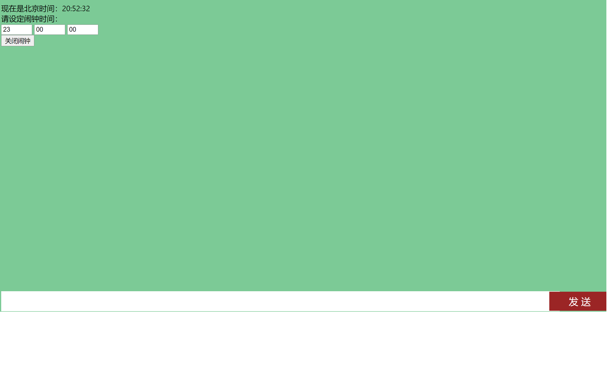

# 叮叮叮~前端小闹钟！

#### Q：我们的作品有什么用？

A：最大的用处，我说疫情打卡你应该不会反驳吧。上班需要打卡，上学需要打卡。。。而且要十二点前，如果忘了怎么办？这是一款针对电脑er的小闹钟，当你设置了闹钟响铃时间，到点他就会字体变红，疯狂弹alert窗口提醒你。

#### Q：那我手机上订个闹铃也可以呀，为什么要用你这个呢？

A：首先，我们的程序操作很简单的，把它放在桌面，想用的时候打开就可以。不让看手机的上班族福利呀！像我们这些程序员，真的不喜欢打代码的时候还要处理手机的消息。。。

#### Q：那为什么会有一个聊天室呢？

A：这就是我们的特色啦，我们可以说唯一具有闹钟功能的聊天室，唯一具有聊天室功能的闹钟。你以为它是一个单纯的聊天室？那你就错啦！现在，它是集成了**融云IM sdk**的聊天室，以后它会集成更多更有用的功能，我们的下一个目标就是集成融云的音视频，让聊天室更强大。现在聊天室可以实现抓取二十条历史消息的功能，也就是可以当一个备忘录来使用，记录你今天几点要打卡，为什么要打卡都是没问题的呀！

#### Q：那说了这么多，给我看看你们的作品吧！

A：

#### Q：哇，界面干净整洁！功能完成100%，耦合度低，可以啊！那怎样使用呢？

A：很简单，把我项目文件中的naozhong.html下载下来，在浏览器中打开就可以啦！