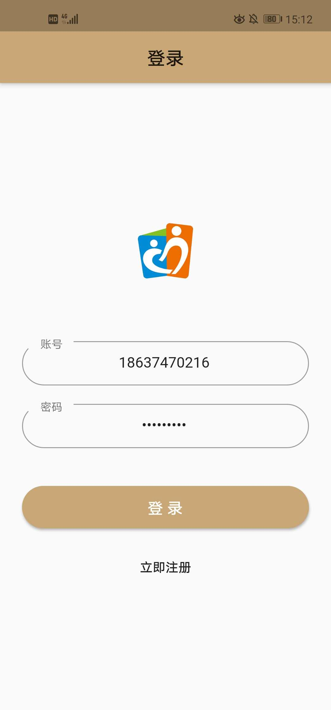
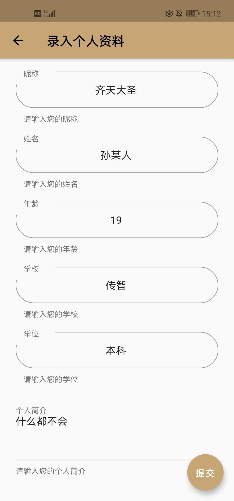
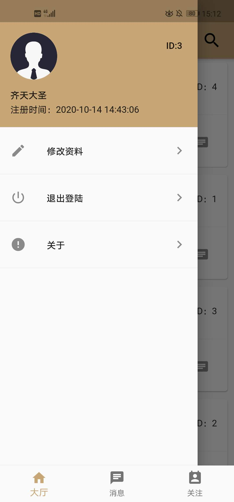
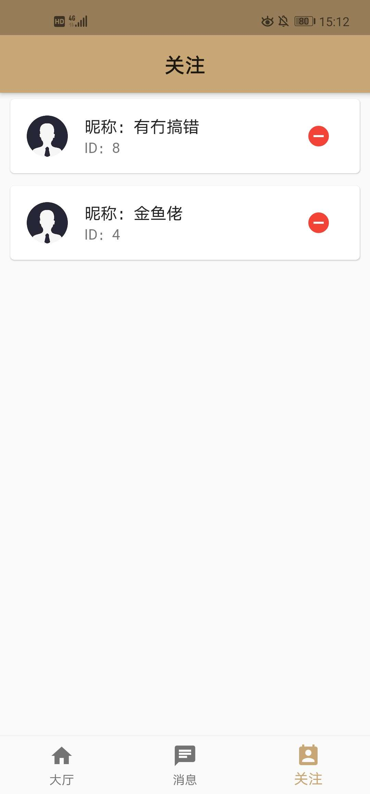
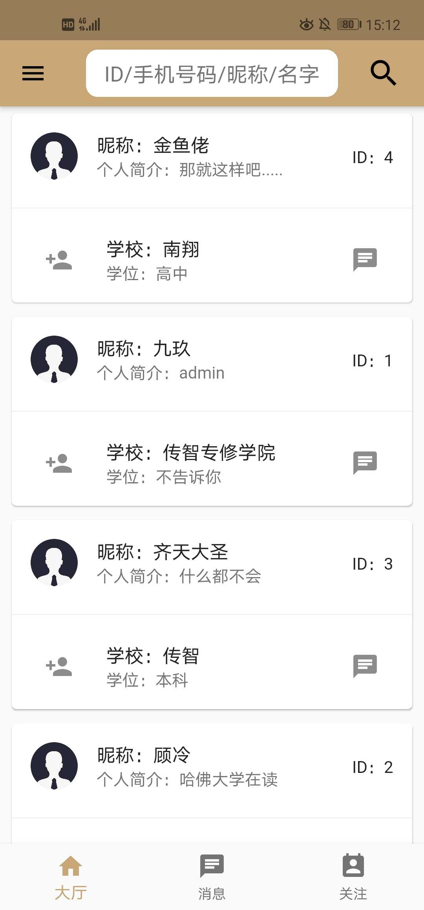
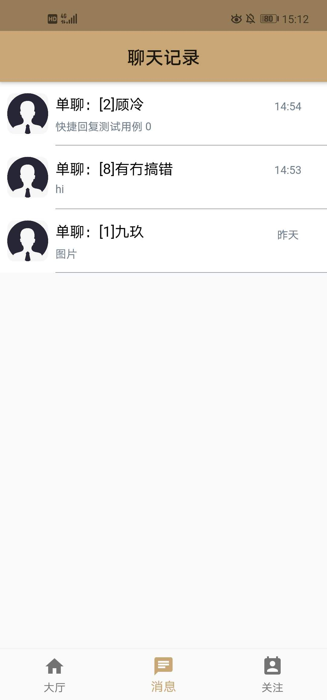

## 学生帮学习交流软件 ——Student Gang

 		该软件服务于 学生知识  、爱好、擅长技能沟通交流。

### 项目使用技术

##### dart

##### flutter

##### PHP

##### mysql

##### 融云IM SDK

### 文件目录

* sGang文件夹：flutter源码
* apk文件夹：真机安装包
* 后台+数据库

### 主体功能介绍

1.用户注册模板

2.用户登录模板

3.用户个人资料录入模板

4.用户修改个人资料模板

5.大厅用户资料渲染模板

6.关注好友列表渲染模板

7.退出登录功能

8.聊天对话功能（融云IM SDK）

9.拍照视频语音功能

10.下拉刷新功能

11.上拉加载功能

12.关注好友聊天功能

13.大厅搜索快捷找到你想要的人

### 项目图片预览

