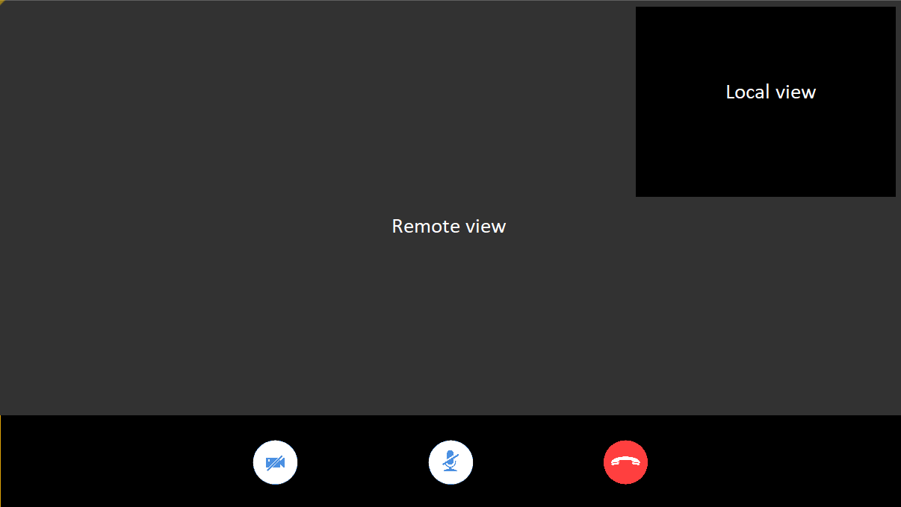
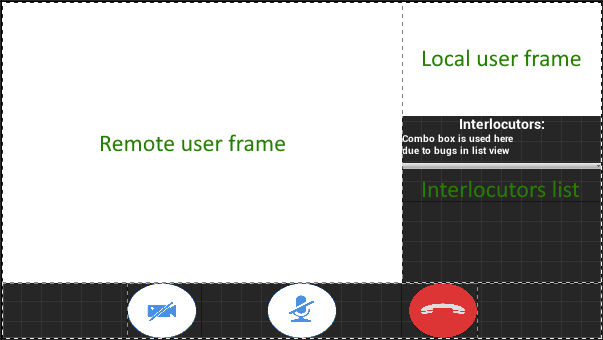
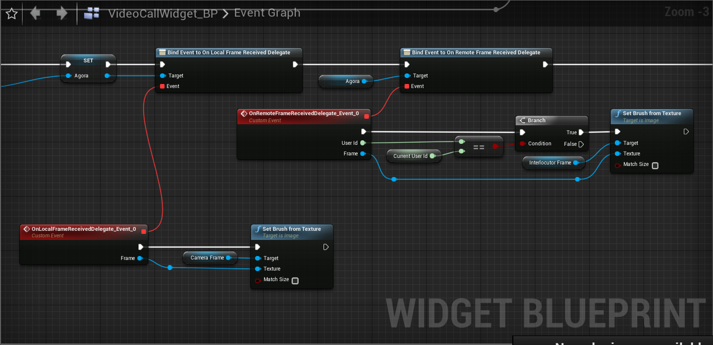
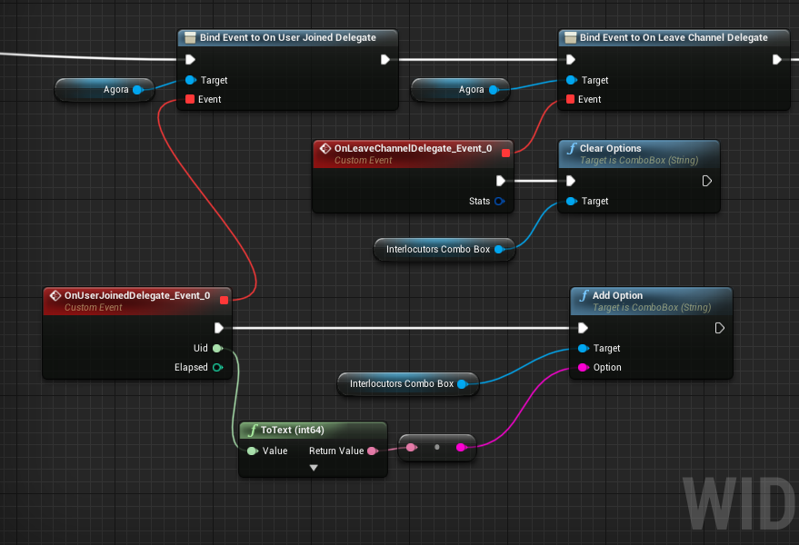
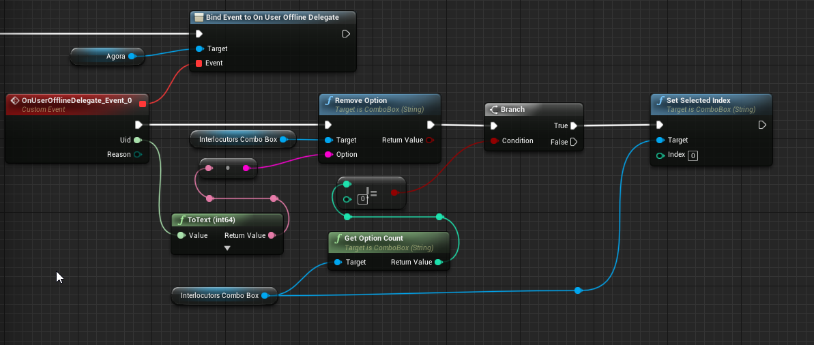
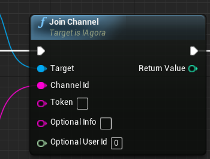

Use this guide to quickly start a basic voice/video call with the Agora SDK Plugin for Unreal Engine on Windows and MacOS.

## Try the demo

We provide an open-source #TODO:link demo project that implements the basic one-to-one video call on GitHub. You can try the demo and view the source code.

## Prerequisites

- Unreal Engine 4.23 or later
- Microsoft Visual Studio or Xcode( version required by Unreal Engine )
- A Windows device running Windows 7 or later or Mac device
- A valid Agora account. (<a href="https://dashboard.agora.io/?_ga=2.169392609.1139696370.1573117530-1815680581.1567671681" target="_blank">Sign up</a> for free)

### Open the specified ports in Firewall Requirements if your network has a firewall.

<a href="https://docs.agora.io/cn/Agora%20Platform/firewall?platform=All%20Platforms" target="_blank">Firewall Requirements</a>

## Set up the development environment

In this section, we will create an Unreal Engine project and integrate the plugin into the project.

## Create a project

Now, let's build a project from scratch. Skip to **Installation** if a project already exists.

1. Open **Unreal Engine Editor** and click **New project**.
2. On the **New Project** panel, choose C++ as the project type, input the project name, choose the project location, and click **Create Project**.

## Installation

Follow these steps to integrate the Agora Plugin into your project.

1. Copy the plugin to [your_project]/Plugins
2. Add plugin dependency into Source/[project_name]/[project_name].Build.cs, Private Dependencies section
`PrivateDependencyModuleNames.AddRange(new string[] { "AgoraPlugin", "AgoraBlueprintabe" });`
3. Restart **Unreal Engine** (if it is running), go to **Edit->Plugins**. Find category **Project->Other** and make sure plugin is enabled.


4. If the version of your Unreal Editor is 4.24 or higher add the following into [your_project]/Source/[project_name]Editor.Target.cs

`DefaultBuildSettings = BuildSettingsVersion.V2;`

## Implement the basic call

- [C++ approach](#c-approach)
- [Blueprints approach](#blueprints-approach)

### C++ approach

1. Create the UI

Create the user interface (UI) for the one-to-one call in your project. Skip to **Initialize AgoraRtcEngine** if you already have a UI in your project.

For a video call, we recommend adding the following elements into the UI:

- The local video view
- The remote video view	
- The end-call button

When you use the UI setting of the demo project, you can see the following interface:



2. Initialize AgoraRtcEngine

Create and initialize the AgoraRtcEngine object before calling any other Agora APIs.

In this step, you need to use the App ID of your project. Follow these steps to create an Agora project in Dashboard and get an App ID.

1. Go to <a href="https://dashboard.agora.io/?_ga=2.266490958.1139696370.1573117530-1815680581.1567671681" target="_blank">Dashboard</a>  and click the **Project Management** icon on the left navigation panel.
2. Click **Create** and follow the on-screen instructions to set the project name, choose an authentication mechanism, and click **Submit**.
3. On the **Project Management page**, find the **App ID** of your project.

Call the `createAgoraRtcEngine` method and the `initialize` method, and pass on the App ID to initialize the AgoraRtcEngine object.


```cpp

RtcEnginePtr = TSharedPtr<agora::rtc::ue4::AgoraRtcEngine>(agora::rtc::ue4::AgoraRtcEngine::createAgoraRtcEngine());

static agora::rtc::RtcEngineContext ctx;
ctx.appId = "aab8b8f5a8cd4469a63042fcfafe7063";
ctx.eventHandler = new RtcEngineEventHandler();

int nRet = RtcEnginePtr->initialize(ctx);

```

3. Set the local video view and the remote video view

If you are implementing a voice call, skip to **Join a channel**. After initializing the AgoraRtcEngine object, set the local video view before joining the channel so that you can see yourself in the call.
Follow these steps to configure the video view:

- Call the `enableVideo` method to enable the video module.
    
- You need to implement the IVideoFrameObserver class, register the following callbacks according to your scenarios:
	
	-`onCaptureVideoFrame`: Occurs each time the SDK receives a video frame captured by the local camera.
		
	-`onRenderVideoFrame`: Occurs each time the SDK receives a video frame sent by the remote user.
	
- Create AgoraMediaEngine object and use `registerVideoFrameObserver` method to register your IVideoFrameObserver implementation.

```cpp

class AGORAVIDEOCALL_API VideoFrameObserver : public agora::media::IVideoFrameObserver
{
public:
	virtual ~VideoFrameObserver();
public:
	bool onCaptureVideoFrame(VideoFrame& videoFrame) override;

	bool onRenderVideoFrame(unsigned int uid, VideoFrame& videoFrame) override;
};

```

```cpp	

TSharedPtr<agora::media::ue4::AgoraMediaEngine> MediaEnginePtr 
	= TSharedPtr<agora::media::ue4::AgoraMediaEngine>(agora::media::ue4::AgoraMediaEngine::Create(RtcEnginePtr.Get()));
TUniquePtr<VideoFrameObserver> VideoFrameObserverPtr = MakeUnique<VideoFrameObserver>();
MediaEnginePtr->registerVideoFrameObserver(VideoFrameObserverPtr.Get());
	
```

4. Render video frames 

IVideoFrameObserver callbacks return VideoFrame that data format is YUV420. First you need to to convert it to ARGB:

```cpp
bool VideoFrameObserver::onCaptureVideoFrame(VideoFrame& Frame)
{
	auto BufferSize = agora::media::ue4::AgoraVideoFrameConverter::getOutBufferSize(
		Frame.width,
		Frame.height);
	uint8_t* CaptureBuffer = new uint8_t[BufferSize];
	
	uint8_t* SrcY = static_cast<uint8_t*>(Frame.yBuffer);
	uint8_t* SrcU = static_cast<uint8_t*>(Frame.uBuffer);
	uint8_t* SrcV = static_cast<uint8_t*>(Frame.vBuffer);
	agora::media::ue4::AgoraVideoFrameConverter::convertVideoFrameToARGB(
		SrcY, SrcU, SrcV, Frame.yStride, Frame.uStride, Frame.vStride, Frame.width, Frame.height, CaptureBuffer);
		
	//Process CaptureBuffer
}
```

Then render like this:

```cpp
//.h file
UPROPERTY(BlueprintReadOnly, meta = (BindWidget))
	UImage* RenderTargetImage = nullptr;
UPROPERTY(EditDefaultsOnly)
	UTexture2D* RenderTargetTexture = nullptr;
uint8* Buffer = nullptr;
uint32_t Width = 0;
uint32_t Height = 0;
FUpdateTextureRegion2D* UpdateTextureRegion = nullptr;
FSlateBrush Brush;

//.cpp file

auto UpdateTextureRegion = new FUpdateTextureRegion2D(0, 0, 0, 0, Width, Height);
auto RenderTargetTexture = UTexture2D::CreateTransient(Width, Height);
RenderTargetTexture->UpdateResource();
RenderTargetTexture->UpdateTextureRegions(0, 1, UpdateTextureRegion, Width * 4, (uint32)4, Buffer);
Brush.SetResourceObject(RenderTargetTexture);
RenderTargetImage->SetBrush(Brush);
```

5. Join a channel

After initializing the AgoraRtcEngine object and setting the local video view (for a video call), you can call the joinChannel method to join a channel. In this method, set the following parameters:

- `channelName`: Specify the channel name that you want to join.

- token: Pass a token that identifies the role and privilege of the user. You can set it as one of the following values:
	- NULL.
	- A temporary token generated in Dashboard. A temporary token is valid for 24 hours. For details, see 
	<a href="https://docs.agora.io/en/Agora%20Platform/token?platform=All%20Platforms#get-a-temporary-token" target="_blank">Get a Temporary Token</a> .
	- A token generated at the server. This applies to scenarios with high-security requirements. For details, see 
	<a href="https://docs.agora.io/en/Video/token_server" target="_blank">Generate a token from Your Server</a>.
	> If your project has enabled the app certificate, ensure that you provide a token.

- uid: ID of the local user that is an integer and should be unique. If you set uid as 0, the SDK assigns a user ID for the local user and returns it in the `onJoinChannelSuccess` callback.
	
```cpp	
RtcEnginePtr->setEncryptionMode("aes-256-xts");
if (!EncryptionToken.IsEmpty())
{
	int nRet = RtcEnginePtr->setEncryptionSecret(TCHAR_TO_ANSI(*EncryptionToken));
	if (nRet < 0)
	{
		return false;
	}
}

int nRet = RtcEnginePtr->setChannelProfile(agora::rtc::CHANNEL_PROFILE_COMMUNICATION);
if (nRet < 0)
{
	return false;
}
std::uint32_t nUID = 0;
nRet = RtcEnginePtr->joinChannel(NULL, TCHAR_TO_ANSI(*ChannelName), NULL, nUID);
if (nRet < 0)
{
	return false;
}
```
	
6. Leave the channel

Call the `leaveChannel` method to leave the current call according to your scenario, for example, when the call ends, when you need to close the app, or when your app runs in the background.

### Blueprints approach

1. Create the UI

Create the user interface (UI) for the call in your project. Skip to **Initialize Agora** if you already have a UI in your project.

For a video call, we recommend adding the following elements into the UI:

- The local frame image.
- The remote frame image.
- Interlocutors list.
- The end-call button.

When you use the UI setting of the demo project, you can see the following interface:



2. Initialize Agora

Create and initialize the Agora object before calling any other Agora APIs.

In this step, you need to use the App ID of your project. Follow these steps to create an Agora project in Dashboard and get an App ID.

1. Go to <a href="https://dashboard.agora.io/?_ga=2.266490958.1139696370.1573117530-1815680581.1567671681" target="_blank">Dashboard</a>  and click the **Project Management** icon on the left navigation panel.
2. Click **Create** and follow the on-screen instructions to set the project name, choose an authentication mechanism, and click **Submit**.
3. On the **Project Management page**, find the **App ID** of your project.

Create the Agora object and call the `Initialize` method, and pass on the App ID to initialize the Agora object.


3. Set the local video view and the remote video view

If you are implementing a voice call, skip to **Join a channel**. 
To get frames from local camera and remote users bind events to agora callbacks:



Implement **User Joined**, **Leave Channel** and **User Offline** events:




To switch between different users use Combo Box and **Current User Id** variable.


 
4. Join a channel

After initializing the Agora object and setting the required callbacks, you can join channel with JoinChannel method to. In this method, set the following parameters:

- `ChannelName`: Specify the channel name that you want to join.

- `Token`: Pass a token that identifies the role and privilege of the user. You can set it as one of the following values:
	- Empty.
	- A temporary token generated in Dashboard. A temporary token is valid for 24 hours. For details, see 
	<a href="https://docs.agora.io/en/Agora%20Platform/token?platform=All%20Platforms#get-a-temporary-token" target="_blank">Get a Temporary Token</a> .
	- A token generated at the server. This applies to scenarios with high-security requirements. For details, see 
	<a href="https://docs.agora.io/en/Video/token_server" target="_blank">Generate a token from Your Server</a>.
	> If your project has enabled the app certificate, ensure that you provide a token.

- `Optional Uid`: ID of the local user that is an integer and should be unique. If you set uid as 0, the SDK assigns a user ID for the local user and returns it in the `OnJoinChannelSuccess` callback.
	


5. Leave the channel

Call the `LeaveChannel` method to leave the current call according to your scenario, for example, when the call ends, when you need to close the app, or when your app runs in the background.


## Run the project in Unreal Editor

Run the project on your Windows or Mac device. You can see both the local and remote video views when you successfully start a one-to-one video call in your app.

## Package the project
To package the project, in **Unreal Editor**, go to the **File->Package Project->Windows->Windows(64-bit)** or **Mac**, then select a folder where you want to package and wait for result.

Now need to package the plugin:

**Edit->Plugins->** Skip Built-In plugins and scroll down to **Project**, click on **Other**  to find **AgoraPlugin**, then **Package**, and select the folder inside the packaged project.

Now you can ran the application from:
[packaged_project_dir]/WindowsNoEditor/[your_project.exe or .app]

## Mac permissions
Add the following permissions in the info.plist file for device access according to your needs:

Privacy - Camera Usage Description

Privacy - Microphone Usage Description

## iOS packaging
To package the project fot iOS, you need to generate **Signing Certificate** and **Provisioning Profile**. 
Follow the instructions from UE4 documentstion: [iOS Provisioning](https://docs.unrealengine.com/en-US/Platforms/Mobile/iOS/Provisioning/index.html)

Then you need to add the sertificate and provisioning profile to your project.


Go to the **Edit->Project Settings->Platforms: iOS**, then select the sertificate and provisioning profile you created before. 

If you don't see one of them in the table, click  **Import Certificate** or **Import Provision**, chose the right file in Finder and click **Open**. 

Then enter a Bundle Identifier: it must be the Bundle Id you used while sertificate creation.

## iOS permissions
In the iOS you also need the following permissions:

Privacy - Camera Usage Description

Privacy - Microphone Usage Description

To add them in the info.plist go to the **Edit->Project Settings->Platforms: iOS** and enter the following line to Additional Plist Data: 
`<key>NSCameraUsageDescription</key><string>AgoraVideoCall</string> <key>NSMicrophoneUsageDescription</key><string>AgoraVideoCall</string>`

Now you are ready to package your project for iOS or launch it on iOS device.

## Documentation
Open the Doc/c++/html/index.html or Doc/blueprints/html/index.html file to view plugin documentation
