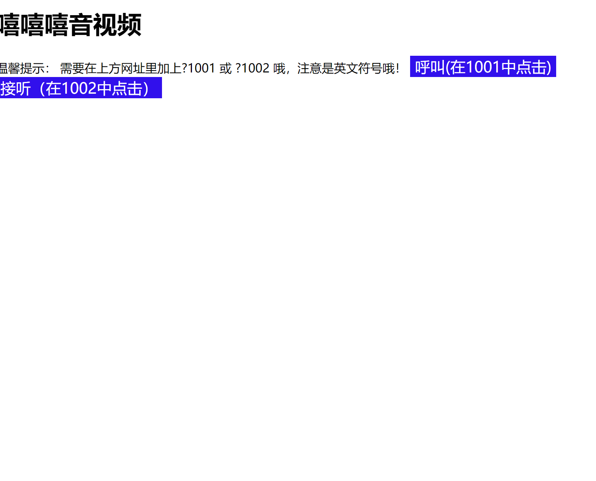

## 作品简介：

集成了融云音视频sdk，是最最最最最最原始的版本，可在此作品上做任何的二次开发。可以说是最使用的作品了吧。

任何你能想到的音视频项目，都会用到ta，自习室，音视频聊天等等。

## 技术：

融云音视频sdk

## 使用：

git clone 后，打开一个index.html，在网址最后加上?1001，打开另一个index.html，在网址后加上?1002

在1001中点发起音视频，在1002中接收音视频。

