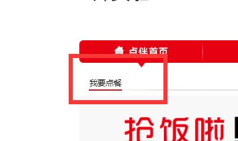

# 项目介绍  
## 队名  
zezeze
## 项目名  
Dinner    

## 项目简介  
本项目展现了线上外卖点餐的场景，使用到融云即时通讯的sdk实现了一个聊天室，用户可以通过实时聊天进行外卖点餐。  

## 使用说明  
运行程序后访问localhost：8080/index,可进入外卖网站的首页，将鼠标放在点餐首页上会出现“我要点餐”的下拉菜单，点击“我要点餐”即可进入点餐聊天室，通过线上交流进行点餐。
   

## 功能展示  
在主页展示了点餐时间，餐品信息。  
  
进入点餐聊天室，通过实时聊天进行外卖点餐。  
  