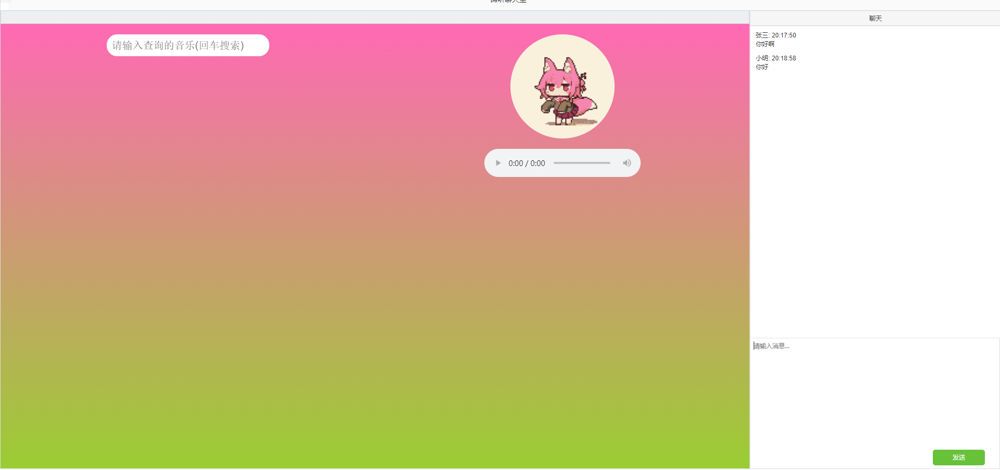
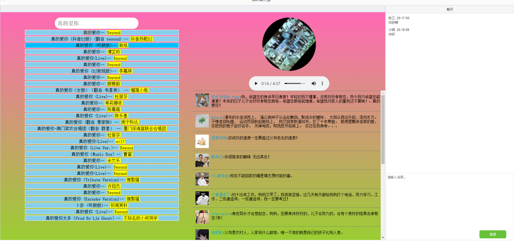

# 谛听音乐聊天室

## 项目介绍

这是一个音乐向的聊天室软件,在这个人心浮躁，物欲横流的社会里生活中，总有这么一部分人，他们习惯上认为，成绩只有展示出来才能够证明自己的优秀，才能够被人高看一眼。

因此他们从不懂得收敛自己的锋芒，稍微有点成绩就洋洋自得，恨不得弄得尽人皆知。

然而，真的当他们这样做了，却发现，事实和想象的并不一样，甚至是完全相反。

高调的炫耀，不仅没有让他们获得更多人的认可，反而让他们处处受人排挤,于是诞生了这么一款谛听音乐聊天室,让双方进行心灵上的沟通,用音乐来安静的享受着这一刻的宁静.......

## 项目展示

[点我前往项目展示页面](https://www.wanlum.com/)

## 前端技术栈

- HTML5
- SCSS
- JQuery
- 融云 IM SDK
- bootstrap
- flexible
- dayjs

## 后端技术栈

- Promise
- axios
- ejs
- express
- express-session
- moment
- mysql
- request
- rongcloud-sdk
- urlencode

## 参赛人员

<table>
    
     
     
</table>
