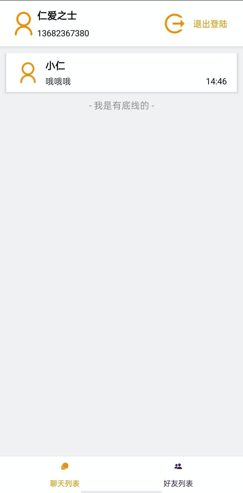

## 仁爱之士

### 简介

- 使用了融云的IM sdk完成了基本的聊天功能，
完成的功能有登陆/注册/加好友/通过或拒绝请加好友请求/聊天

### 测试账号

- 账号：13682367380 密码：123456

- 账号：13682367381 密码：123456

- 可以自行在app里注册账号，无需真正发送验证码，输入`9999`即可注册，需要注意的是最好使用真实号码注册，不然有机率出现注册后拿不到融云返回的token

### 编译好的真机安装包

- 见apk文件夹，真机安装app-release.apk即可体验

### 使用到的融云技术

- 最新版的融云IM sdk
 
### 后端服务

- 使用的是sealtalk的后端代码

### 项目运行

- 首先需要搭建好react native运行环境，具体可以参考[react native官方文档环境搭建](https://reactnative.dev/docs/environment-setup)

- 然后在项目根目录下运行 `yarn install`

- 连接好真机后，运行 `yarn android`

### 联系方式

- 手机：13682367380
