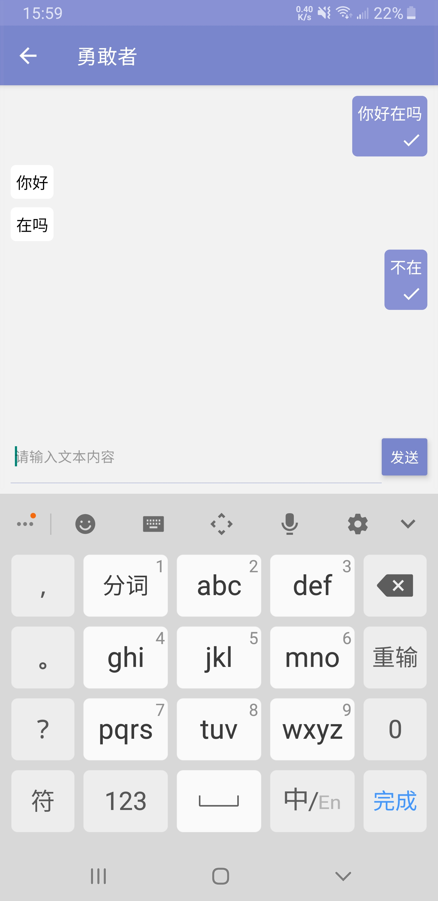

## 勇敢者

### 简介

- 使用融云安卓 im sdk完成了包含基本功能的聊天app

### 使用到的融云技术

- 安卓 融云IM sdk

### 功能

- 登陆

- 注册

- 加好友

- 聊天

- 通过/拒绝好友申请
 
### 后端服务

- [sealtalk-server](https://github.com/sealtalk/sealtalk-server)

### 项目运行

- react native环境搭建，参考[react native官方文档](https://reactnative.dev/docs/environment-setup)

- 然后在项目根目录下运行 `yarn install`

- 连接好真机后，运行 `yarn android`

### 账号

- 账号：18819040182 密码：123456

- 账号：18819040183 密码：123456

- 可以自行在app里注册账号，无需真正发送验证码，输入`9999`即可注册，需要注意的是最好使用真实号码注册，不然有机率出现注册后拿不到融云返回的token，目前原因还不清楚

### 编译好的真机安装包

- 见apk文件夹，安装app-release.apk即可

### 联系方式

- 微信同号：18819040182
