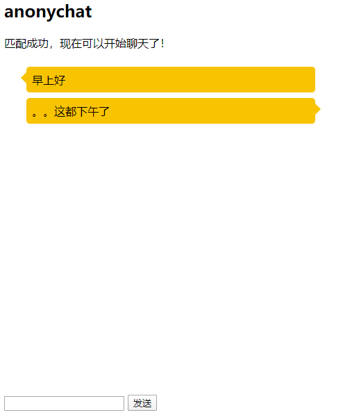

# anonychat
基于融云IMsdk开发的匿名聊天

## 使用的开源库
* rongcloud-sdk
* RongIMLib
* express
* jquery
* vue

## 功能
* 在线匹配
* 匿名聊天

## 在线demo
[打开](https://rong-anonychat.herokuapp.com/)

## 项目运行
1. 安装运行环境`npm install`
2. 运行服务端`npm start`
3. 浏览器打开[http://localhost:8080/](http://localhost:8080/)
4. PS：至少开两个才能看到效果
