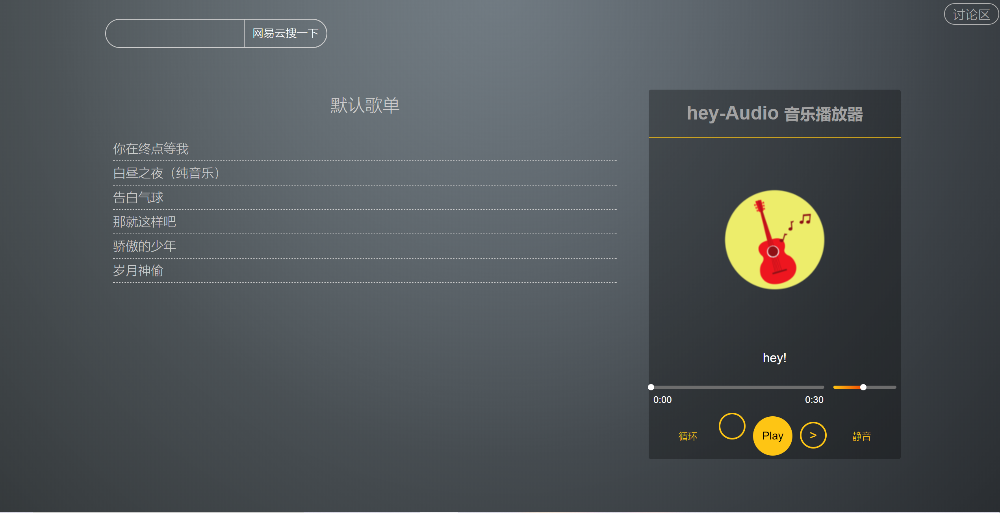
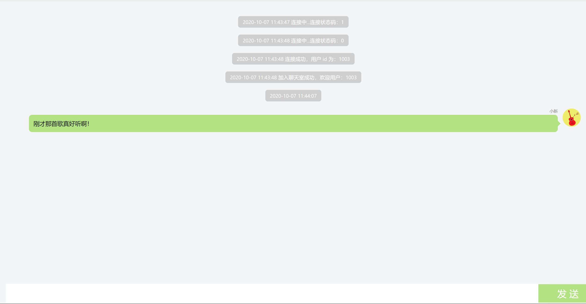

# 听诉
融云IM sdk
html5
JavaScript
# 功能概要

基本功能：
播放、暂停、上一曲、下一曲、单曲循环、列表循环、静音
加强功能：
> 1.点击播放进度条任意位置实现跳转播放
  2.点击音量任意位置实现调整音量
  3.手机端查看响应式适配
  4.实时播放时间显示

## 使用方法：

git clone 到你的目录，在浏览器中打开index.html（建议不用IE）。就可以看到音乐播放器啦！

点击讨论区可以进入chatroom！

对你爱的，你恨的，“评头论足”！

目前可以在本地运行，融云聊天室可以获取20条历史记录。日后考虑放到服务器。

## spotlight：

听音乐是个缓解压力的过程，也就是说，来听音乐的大多在生活中有这样那样的不顺，我们在音乐播放器加上聊天的功能，就可以让听者边听音乐，边诉说自己的不快！此谓“听诉”！

# 其他说明
    歌曲是从网易云音乐mp3地址转换所得。
如果您有什么好的想法或者建议，欢迎交流，喜欢的可以点亮星星😯✨~~

音乐播放器界面：

chat界面：
