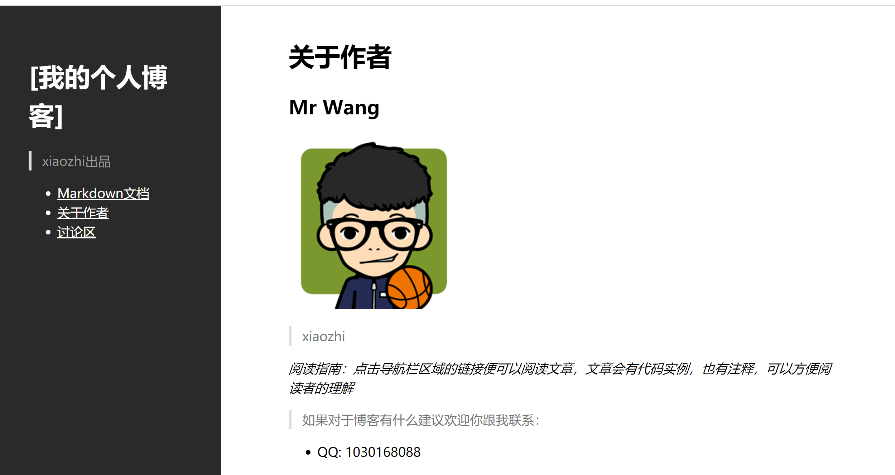
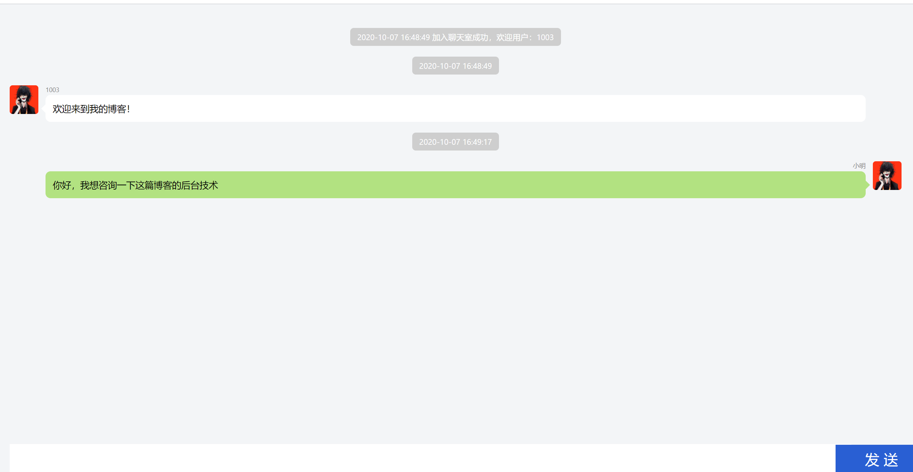

# 开启你的个人博客之旅

## 项目背景：

这是本人在浏览各种网站时，发现都有客服这一选项，那我的博客为什么不能有呢，我觉得这个点子不错。故拿出来给大家分享。

### 感谢您的支持，祝您生活愉快

#### 效果预览：

##### 个人博客页面：

##### 融云IM sdk实现：

## 项目使用：

git clone 到本地后，如果index.html不能正常打开，就通过vscode类的编译软件打开（可安装live server插件）。

如果实在打不开，你就去浏览器打开chat.html好啦！