# 道喜啦 - 放羊小分队

随着城市生活水平的提高，以及当代青年更加追求婚姻的质量和婚礼庆典活动的个性化，婚庆服务行业出现了浪漫、时尚的婚庆服务趋向。婚庆服务也已经从最简单的为新人操办婚事，开始向开发婚礼品牌、注重婚礼文化和职业化建设发展，同时也更需要与时俱进，利用科技手段来达到更为便捷细致的项目策划，此时，婚庆管理系统应运而生。

道喜啦为您提供一站式线上服务，沟通、审核、落实、付款，统统支持线上完成。真正做到足不出户定制婚礼，让您轻松享受完美婚礼!

## 在线婚庆管理系统

随着经济社会的发展，生活节奏加快，越来越多的人们，特别是进入婚龄高峰期的80后，都愿意将婚礼交给专业的婚庆公司来操办，大多数认为，将婚礼交给专业的婚庆公司一来专业的婚庆队伍，有充足的经验。二来非常方便不需要自己操心，非常省时。这也是婚庆行业日益旺盛的主要原因。

通过道喜啦在线婚庆管理系统，用户可以在线浏览道喜啦简介，与客服在线沟通服务细节、审核方案、服务细节监督以及后期制作跟踪，并可进行后期用户反馈，工作人员会全程负责婚礼策划以及后期策划服务。

通过婚庆管理系统这种新颖的互联网模式进行实现，在传统婚庆功能的基础上，努力实现自身产品的价值与特色，获取更多市场利润。

## 功能概述

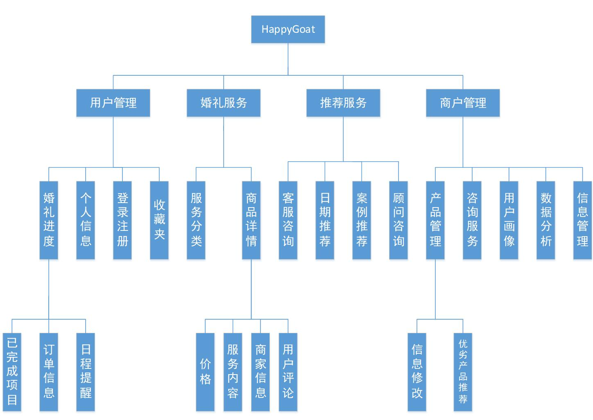
道喜啦主要功能分别是信息管理、婚庆预定、咨询服务、个人中心4个方面：
1. 网站信息管理管理网站新闻信息以及公司信息，往期案例推荐，联系我们以及婚礼相关知识。对这些信息进行添加以及维护。
2. 婚庆预定本模块包括人员安排、车辆租用、婚庆用品选择、其他服务选择、优惠套餐选择，价格估算这6个模块。
3. 咨询服务本模块包括在线齐询、间卷调查、用户反馈。
4. 个人中心本模块包含用户的登录注册，个人信息设置以及我的订单。

## 即时通讯功能
通过融云IM即时通讯SDK实现线上的咨询、沟通功能，方便顾客和婚庆公司的交流。

## 效果图

1. 首页

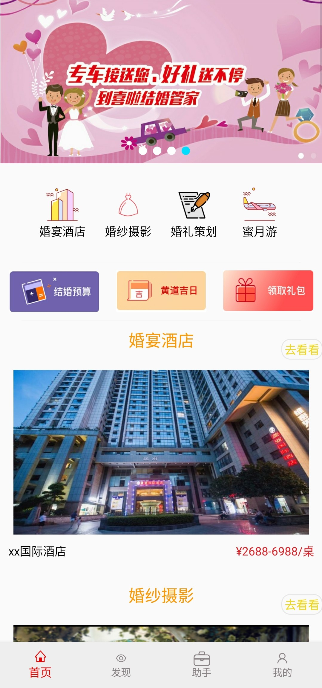

2. 婚礼策划

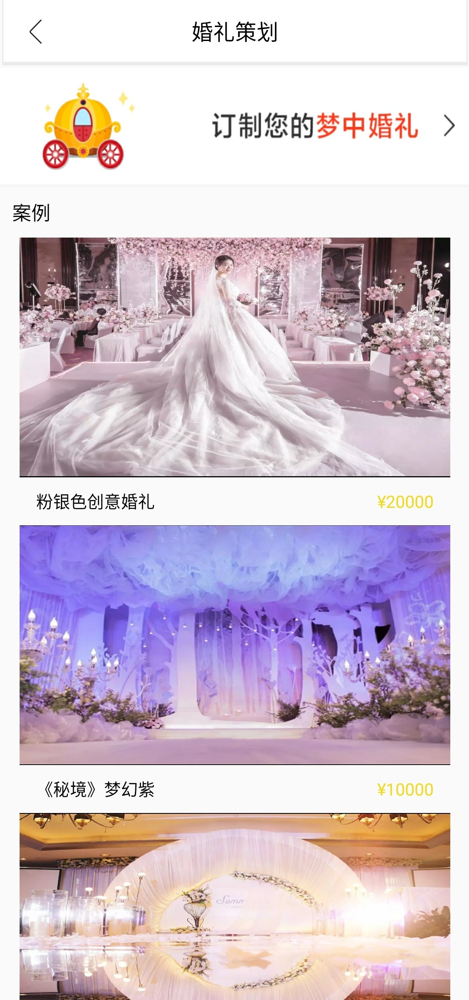
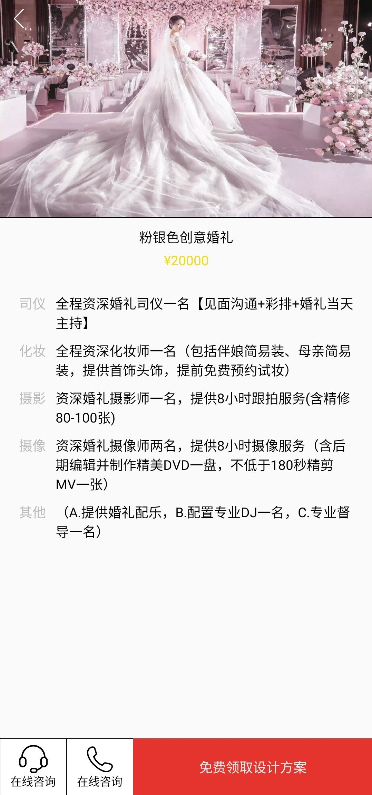

3. 婚纱摄影

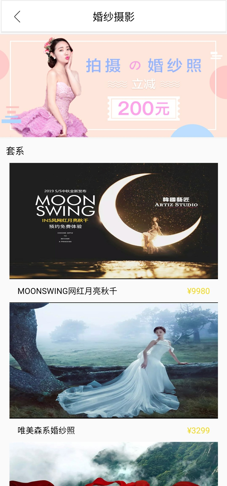
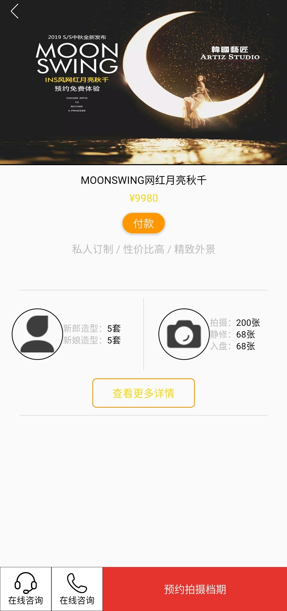

4. 婚宴酒店

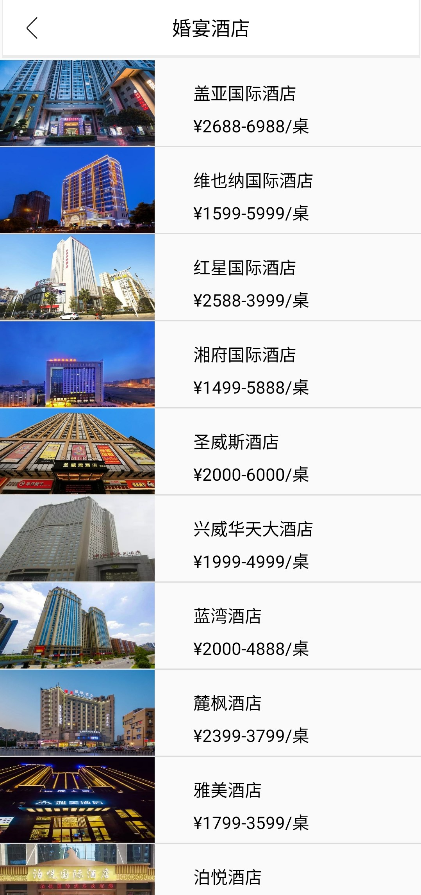
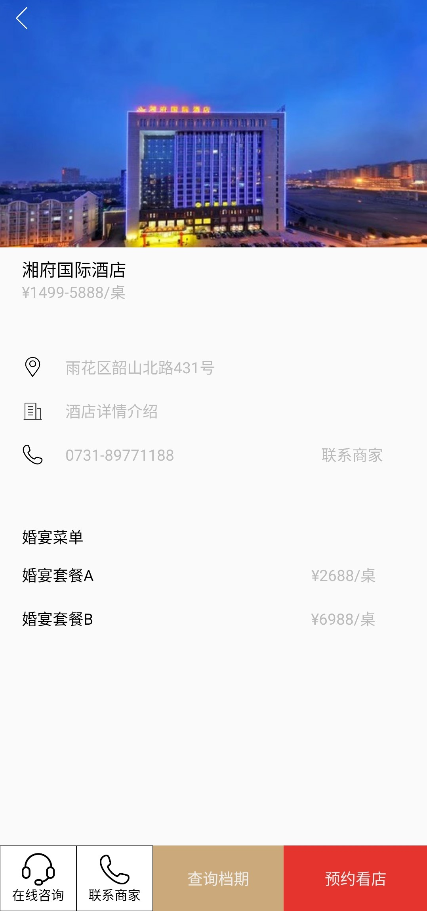

5. 蜜月游

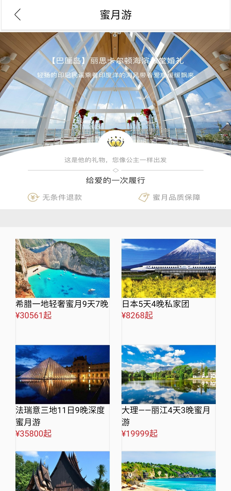
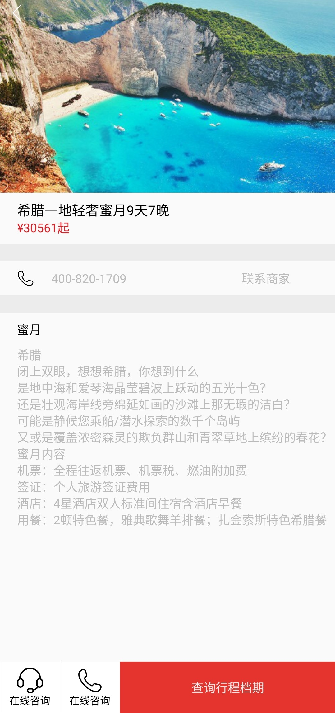

6. 结婚助手

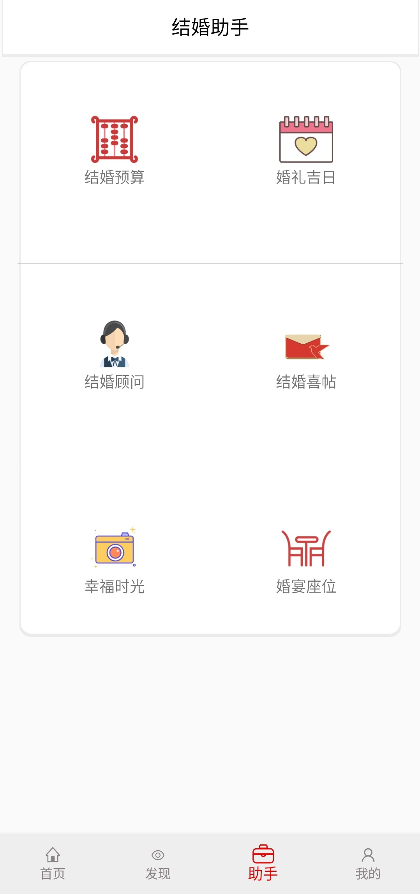
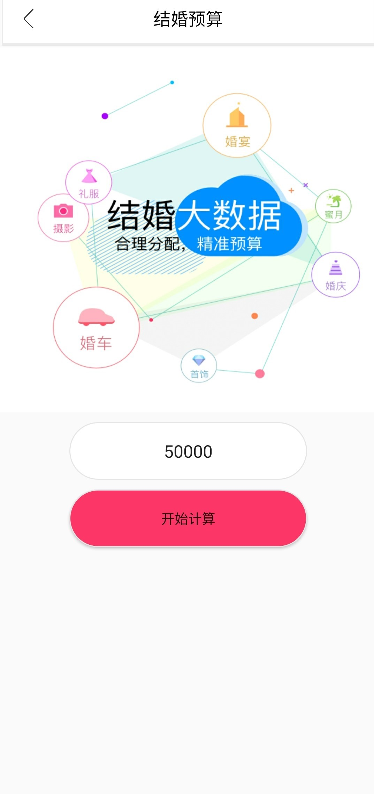

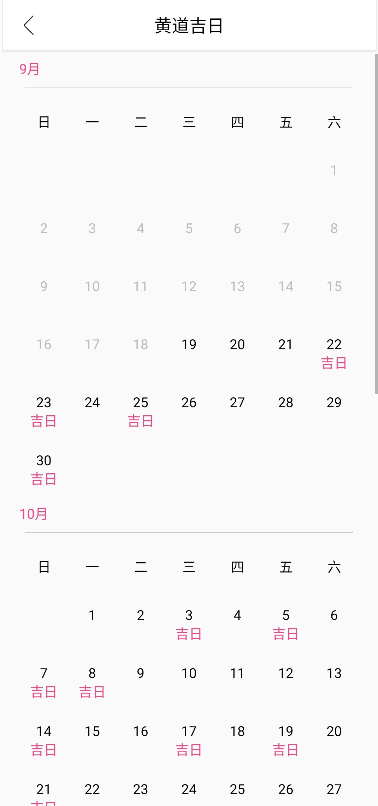

7. 个人主页

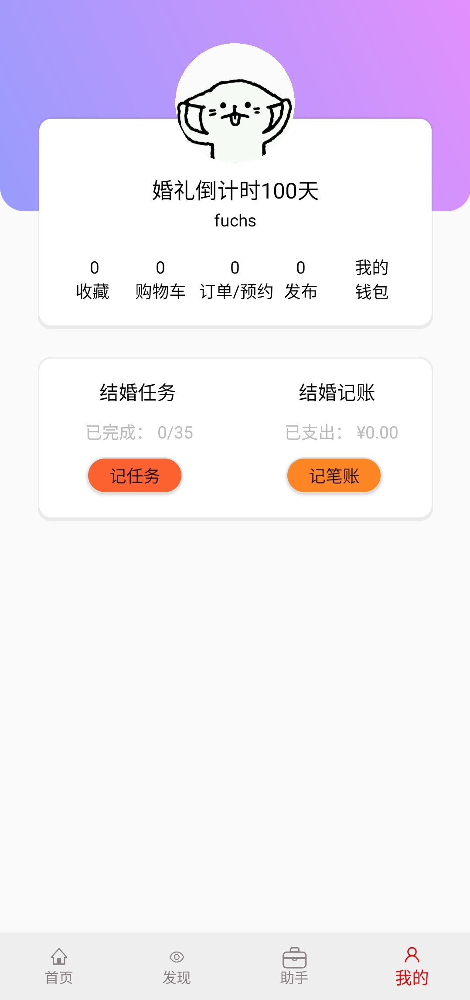
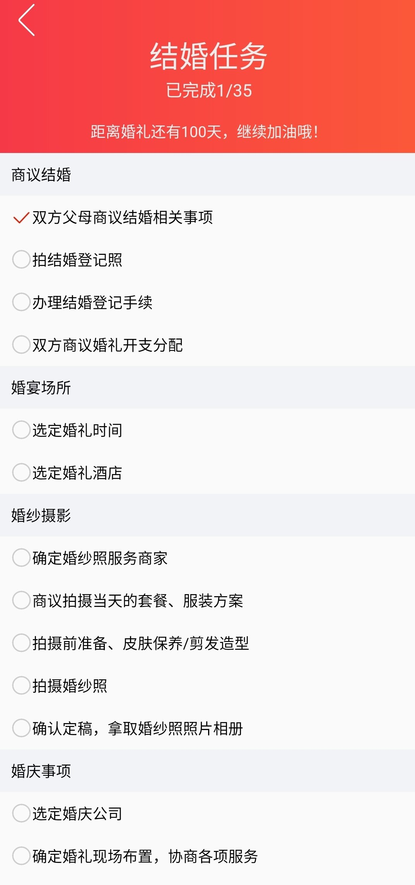

## 使用
* 安卓端 [下载链接](app-debug.apk)