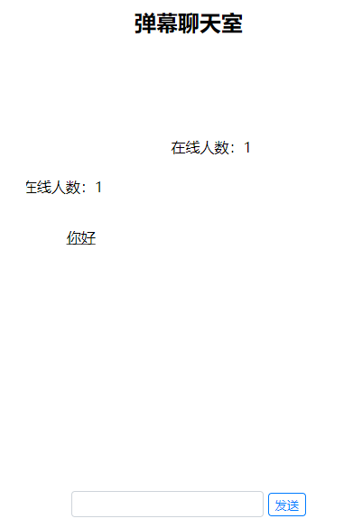

# danmaku-chatroom
基于融云IMsdk开发的弹幕聊天室

## 运行截图

## 使用的开源库
* rongcloud-sdk
* RongIMLib
* express
* jquery
* d3.js

## 功能
* 实时消息
* 匿名聊天
* 弹幕渲染

## 简要说明
匿名用户由server管理，用户打开客户端后从server获取token，然后连接融云IMsdk，弹幕使用d3.js渲染。

## 在线demo
[打开](https://danmaku-chatroom.herokuapp.com/)（国外服务器速度较慢）

## 部署方法
1. 安装运行环境`npm install`
2. 运行`npm start`
3. 浏览器打开[http://localhost:8080/](http://localhost:8080/)
