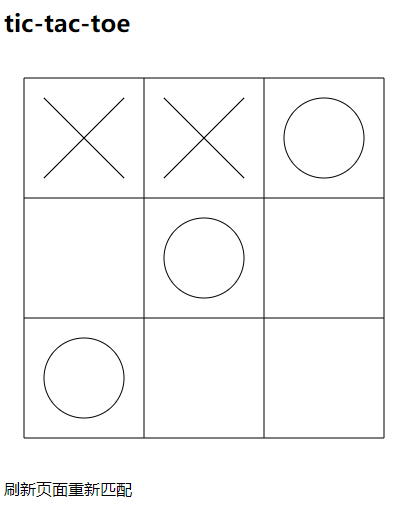

# rong-5
使用融云IMsdk开发的井字棋游戏

## 使用的开源库
* rongcloud-sdk
* RongIMLib
* express
* jquery

## 功能
* 在线匹配
* 双人游戏
* 井字棋
* 胜负判定
* 匿名

## 在线demo
[打开](https://rong-tictactoe.herokuapp.com/)

## 项目运行
1. 安装运行环境`npm install`
2. 运行`npm start`
3. 浏览器打开[http://localhost:8080/](http://localhost:8080/)
