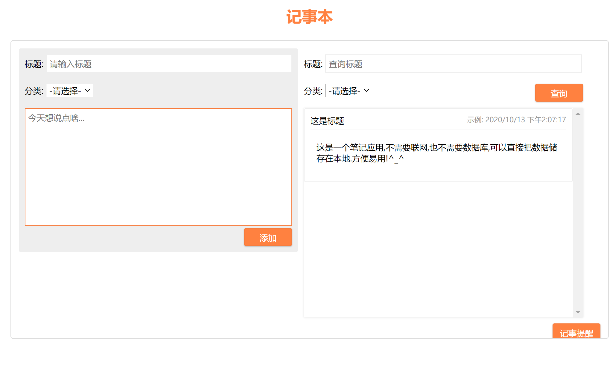
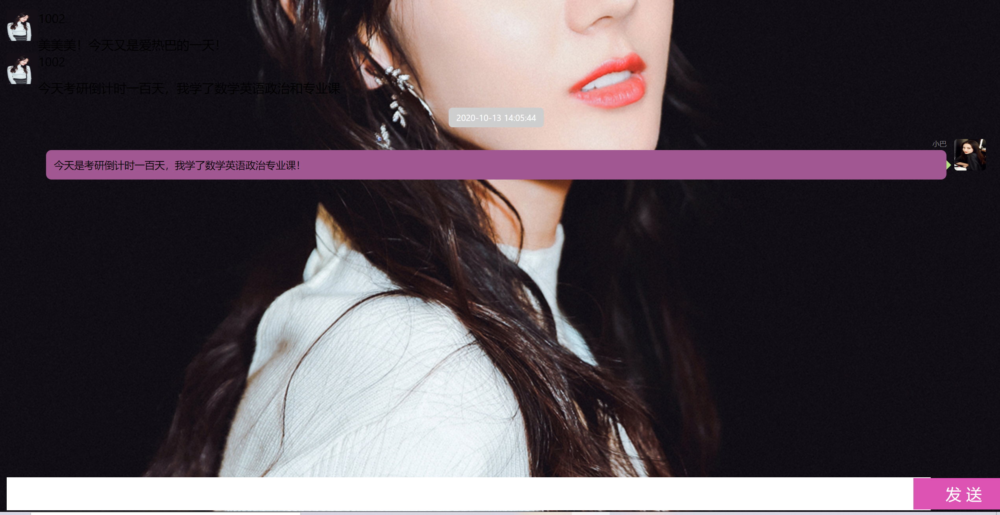

## 技术：

html，css，融云im sdk，JavaScript

## 背景：

鉴于很多人记事很不方便，本队遂使用目前流行的融云sdk集成了此项目，可以记录每天发生的事情，实现一个日记本的功能。

聊天功能的实现可以让条条目目的记事本，变得更像日记本（xTA就是）。本来日记本就是自己给自己唠嗑的嘛，倾吐自己的负面情绪。

## 使用：

git clone 到本地

使用浏览器打开rijiben.html

==你就可以随心所欲地添加日记啦，还可以使用热巴姐姐聊天哦~

## 预览：

