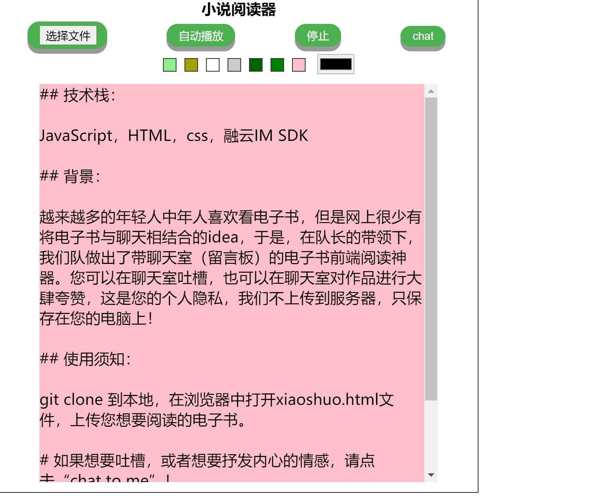
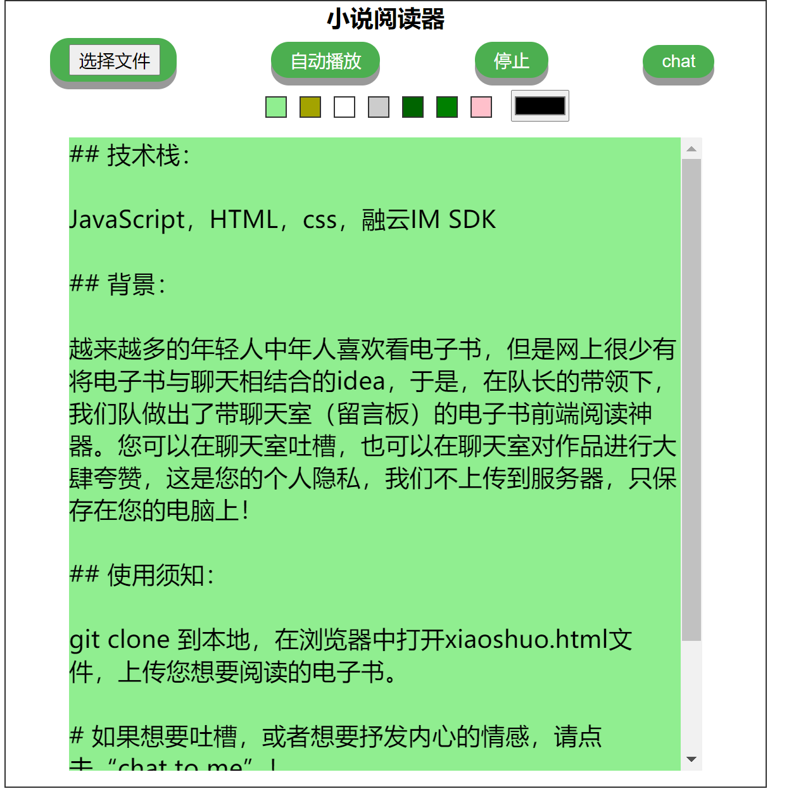
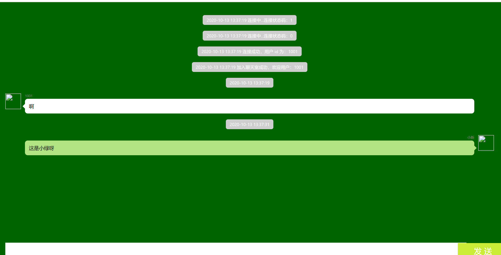
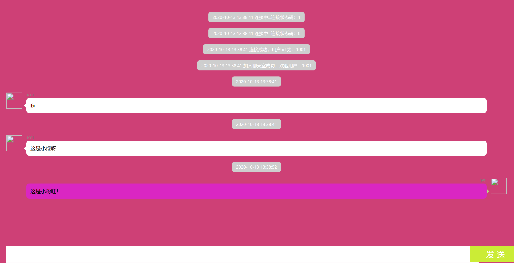

## 技术栈：

JavaScript，HTML，css，融云IM SDK

## 背景：

越来越多的年轻人中年人喜欢看电子书，但是网上很少有将电子书与聊天相结合的idea，于是，在队长的带领下，我们队做出了带聊天室（留言板）的电子书前端阅读神器。您可以在聊天室吐槽，也可以在聊天室对作品进行大肆夸赞，这是您的个人隐私，我们不上传到服务器，只保存在您的电脑上！

## 使用须知：

git clone 到本地，使用vscode或别的编译器，下载live server插件，在编译器中开启服务器就可以成功运行。

（也就是说你找个编译器在网页中打开xiaoshuo.html）

# 如果想要吐槽，或者想要抒发内心的情感，请点击“chat to me”！

## 最最重要的是，我们有无数种配色方案等你来选！

### 真正的DIY！小粉小绿你来定！

小粉：

小绿：

# 还有很多配色就不一一演示啦！

